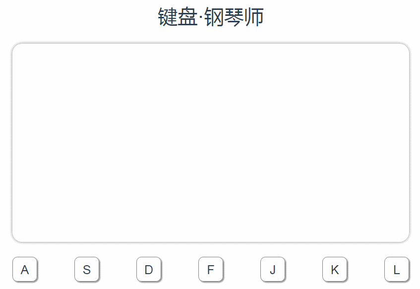

# 键盘·钢琴师小应用
### I am a coder and like music, so it's for you to enjoy music by yourself

### [有音效的演示](https://seven-share.github.io/pianoByKeyboard/dist/index.html)
### 演示图片，没有声音

## 应用说明
- 页面构建比较简单，三个组件keyPress,keyBoard,canvasPanel。分别是按键，键盘和画板
- utils文件夹里封装了两个主要功能，一个是画图，一个是根据频率发出声音
- 画图类构建心得：在类的初始化后，每次刷新调用的是实例内部的方法，这样上面的小方块的数据可以保存在实例内部，同时每次按下按键后传入新的频率高度，实现小方块和频率高度不完全同步的效果
- 画图类里，that.heightChange()函数放在if外部，否则小方块沉底后将不再有频率条显示，注意逻辑即可
- 声音js文件里，声音波形我最后选择是方形波，正弦波两个以上声音在一起发出时有杂音，方形波效果较好，对webaudio操作还是不太熟练，声音控制有待深入
    - [张鑫旭博客](http://www.zhangxinxu.com/wordpress/2017/06/html5-web-audio-api-js-ux-voice/)
- 按键监听使用的是document.onkeypress，vue的语法糖在全局监听好像不能用，如果有可以的案例希望分享给我
- 扩展
    - 可以在keyBoard的letters变量里添加任意的键盘按键，注意是大写，配合频率即可发出声音，注意修改底部按键的css，flex设置换行即可，同时如果按键多，频率多的时候，频率对应的高度可以改为canvas的百分比
- 彩蛋，算彩蛋吗？按空格键是下一个高音do，屏幕没显示该按键
- 温馨提示，系统声音小一点比较好